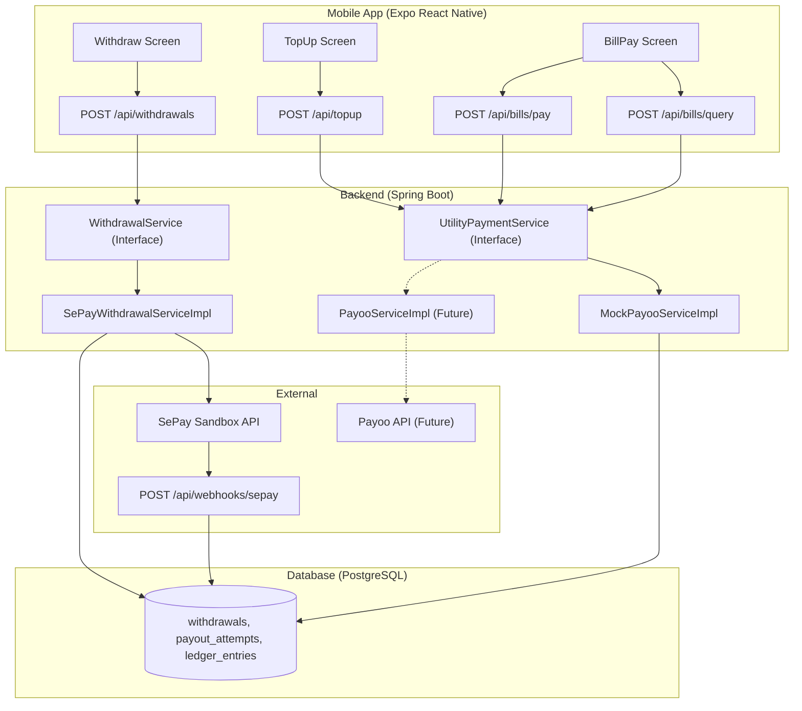
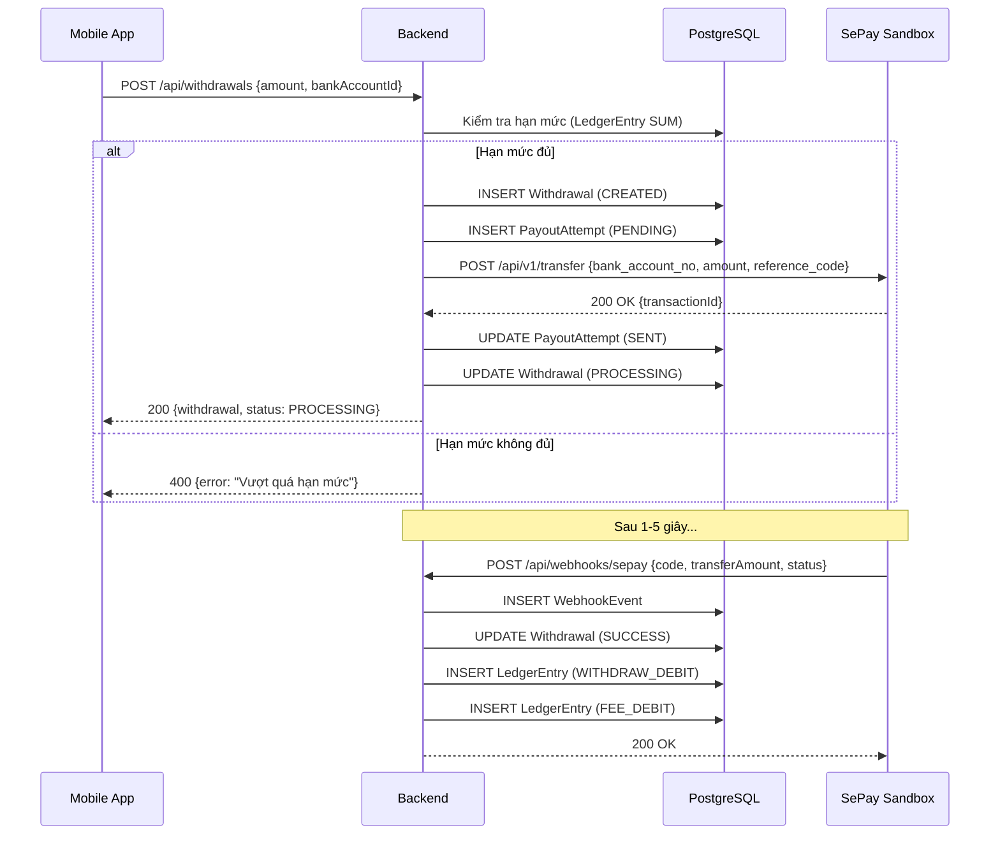
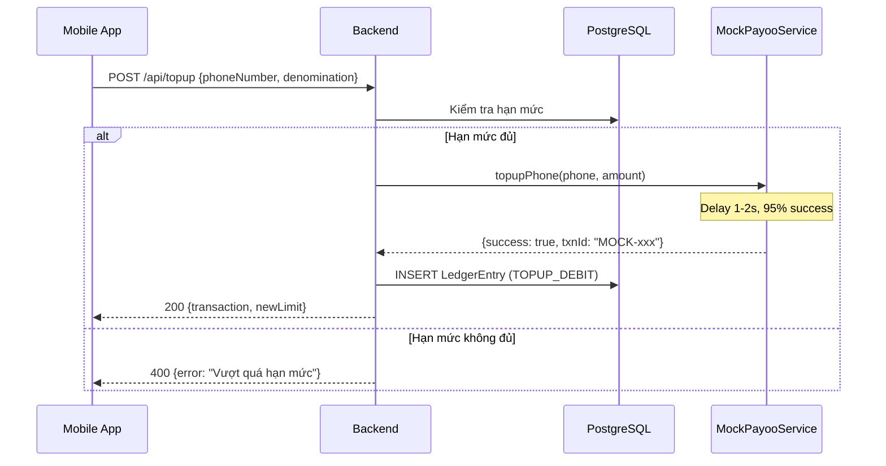
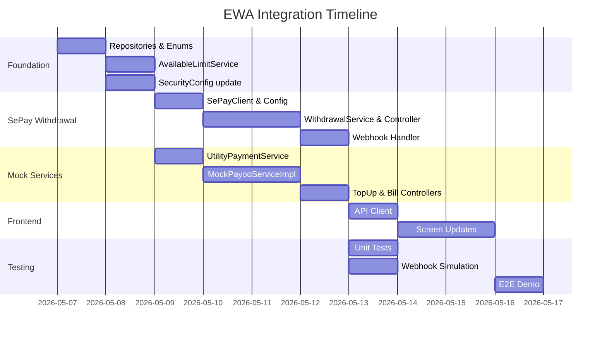

# EWA Payment Integration Plan

> **Strategy:** SePay Sandbox cho Chi hộ (Withdrawal) + MockService cho Nạp ĐT & Hóa đơn (Top-up/Bill Payment)

## Tổng quan Kiến trúc



---

## Phase 1: Nền tảng chung (Foundation)

> [!IMPORTANT]
> Phase này phải hoàn thành trước khi bắt đầu Phase 2 và Phase 3.

### Task 1.1: Tạo các Repository còn thiếu
| File | Mô tả |
|------|--------|
| `WithdrawalRepository.java` | CRUD cho `Withdrawal` entity |
| `PayoutAttemptRepository.java` | CRUD cho `PayoutAttempt` entity |
| `BankAccountRepository.java` | CRUD cho `BankAccount` entity |
| `LedgerEntryRepository.java` | CRUD + query tổng tiền đã dùng theo employee+period |
| `WebhookEventRepository.java` | CRUD + tìm theo `externalTxnId` |
| `PayrollPeriodRepository.java` | Tìm period hiện tại theo employer |
| `PayPolicyRepository.java` | Tìm policy hiện tại theo employer |
| `WorkEntryRepository.java` | Tính tổng ngày công theo employee+period |

### Task 1.2: Cập nhật Enum `LedgerEntryType`
```diff
 public enum LedgerEntryType {
     EARNED,
     WITHDRAW_DEBIT,
     FEE_DEBIT,
+    TOPUP_DEBIT,
+    BILL_DEBIT,
     REFUND_CREDIT,
     ADJUSTMENT
 }
```

### Task 1.3: Tạo Service tính Hạn mức (AvailableLimitService)
- **Input:** `employeeId`, `payrollPeriodId`
- **Logic:**
  ```
  dailyRate = grossSalary / 22
  earnedAmount = dailyRate × workingDays × 50%
  totalUsed = SUM(ledger_entries WHERE employee + period + type IN (WITHDRAW_DEBIT, FEE_DEBIT, TOPUP_DEBIT, BILL_DEBIT))
  availableLimit = floor((earnedAmount - totalUsed) / 1000) * 1000
  ```
- **Output:** `long availableLimitVnd`

### Task 1.4: Cập nhật SecurityConfig
```java
// Thêm webhook endpoint vào danh sách public
.requestMatchers("/api/webhooks/**").permitAll()
```

---

## Phase 2: SePay Withdrawal Integration

> [!NOTE]
> Sử dụng Claude Code command: `/integrate-sepay`

### Task 2.1: Tạo SePay HTTP Client
| File | Package | Mô tả |
|------|---------|--------|
| `SePayClient.java` | `modules.payment.sepay` | WebClient wrapper gọi SePay Sandbox API |
| `SePayConfig.java` | `config` | Bean configuration đọc `SEPAY_API_KEY` từ `.env` |
| `SePayTransferRequest.java` | `modules.payment.sepay.dto` | Request body cho lệnh chuyển tiền |
| `SePayTransferResponse.java` | `modules.payment.sepay.dto` | Response từ SePay |

### Task 2.2: Tạo Withdrawal Module
| File | Package | Mô tả |
|------|---------|--------|
| `WithdrawalService.java` | `modules.withdrawal` | Interface: `createWithdrawal()`, `getWithdrawal()`, `getHistory()` |
| `SePayWithdrawalServiceImpl.java` | `modules.withdrawal.impl` | Implementation gọi SePayClient |
| `WithdrawalController.java` | `modules.withdrawal` | REST endpoints |
| `WithdrawalRequest.java` | `modules.withdrawal.dto` | Request DTO |
| `WithdrawalResponse.java` | `modules.withdrawal.dto` | Response DTO |

### Task 2.3: Tạo Webhook Handler
| File | Package | Mô tả |
|------|---------|--------|
| `WebhookController.java` | `modules.webhook` | Nhận callback từ SePay |
| `SePayWebhookProcessor.java` | `modules.webhook` | Xử lý: cập nhật Withdrawal → SUCCESS, ghi LedgerEntry |

### Task 2.4: Withdrawal Flow Chi tiết



---

## Phase 3: Mock Top-up & Bill Payment

> [!NOTE]
> Sử dụng Claude Code command: `/integrate-mock-services`

### Task 3.1: Tạo Utility Payment Module
| File | Package | Mô tả |
|------|---------|--------|
| `UtilityPaymentService.java` | `modules.utility` | Interface: `topupPhone()`, `queryBill()`, `payBill()` |
| `MockPayooServiceImpl.java` | `modules.utility.impl` | Mock implementation (delay 1-2s, 95% success) |
| `TopupController.java` | `modules.utility` | `POST /api/topup` |
| `BillPaymentController.java` | `modules.utility` | `POST /api/bills/query`, `POST /api/bills/pay` |

### Task 3.2: Tạo DTOs
| DTO | Fields |
|-----|--------|
| `TopupRequest` | `employeeCode, phoneNumber, denomination` |
| `TopupResponse` | `success, transactionId, newLimit, error` |
| `BillQueryRequest` | `serviceType (ELECTRIC/WATER), customerId` |
| `BillQueryResponse` | `customerName, address, amount, period, status` |
| `BillPayRequest` | `employeeCode, billKey` |
| `BillPayResponse` | `success, transactionId, newLimit, error` |

### Task 3.3: Tạo MockDataStore
```java
@Component
public class MockDataStore {
    // Carriers: Viettel, Vinaphone, Mobifone (prefix → name mapping)
    // Bills: Predefined electric & water bills
    // Denominations: 10k, 20k, 50k, 100k, 200k, 500k
}
```

### Task 3.4: Top-up Flow Chi tiết


---

## Phase 4: Frontend Integration

### Task 4.1: Tạo API Client thật
- Thay thế `mockApi.ts` bằng `apiClient.ts` sử dụng `fetch()` gọi đến backend.
- Giữ lại `mockApi.ts` làm fallback khi backend offline.

### Task 4.2: Cập nhật các Screen
| Screen | Endpoint mới |
|--------|-------------|
| `WithdrawScreen` | `POST /api/withdrawals` |
| `TopUpScreen` | `POST /api/topup` |
| `BillPaymentScreen` | `POST /api/bills/query` → `POST /api/bills/pay` |
| `HistoryScreen` | `GET /api/transactions?employeeCode=xxx` |

---

## Phase 5: Testing & Demo

### Task 5.1: Unit Tests
- `AvailableLimitServiceTest` — Kiểm tra công thức tính hạn mức.
- `SePayWithdrawalServiceTest` — Mock SePayClient, kiểm tra luồng tạo withdrawal.
- `MockPayooServiceTest` — Kiểm tra top-up và bill payment logic.

### Task 5.2: Webhook Simulation
- Sử dụng Claude Code command: `/test-webhook`
- Hoặc dùng Postman gửi JSON payload giả lập vào `/api/webhooks/sepay`.

### Task 5.3: End-to-End Demo
1. Đăng nhập NV001 trên App.
2. Rút 500,000 VND → Kiểm tra SePay Sandbox dashboard.
3. Nạp thẻ 50,000 VND → Kiểm tra hạn mức giảm đúng.
4. Thanh toán hóa đơn điện EVN-PE001234 → Kiểm tra lịch sử giao dịch.

---

## Thứ tự ưu tiên triển khai



---

## Claude Code Harness Summary

| Type | File | Mục đích |
|------|------|----------|
| **Command** | `.claude/commands/integrate-sepay.md` | Slash command `/integrate-sepay` |
| **Command** | `.claude/commands/integrate-mock-services.md` | Slash command `/integrate-mock-services` |
| **Command** | `.claude/commands/test-webhook.md` | Slash command `/test-webhook` |
| **Skill** | `.claude/skills/sepay-integration.md` | SePay API reference & patterns |
| **Skill** | `.claude/skills/mock-service-pattern.md` | Mock/Adapter pattern reference |
| **Skill** | `.claude/skills/ewa-backend-architecture.md` | Backend architecture reference |
| **Rule** | `.claude/rules/api-integration.md` | Coding standards cho payment code |
| **Hook** | `.claude/hooks/pre-commit.sh` | Auto-compile check trước commit |
| **Config** | `CLAUDE.md` | Updated with integration strategy |
